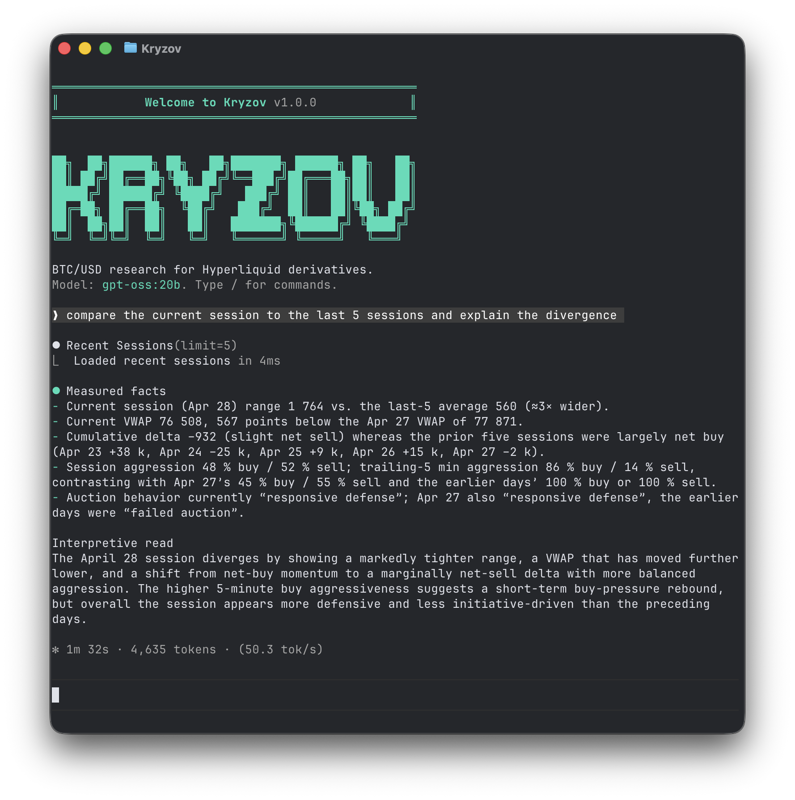

# Kryzov

Kryzov is a terminal-native BTC/USD market research agent for Hyperliquid derivatives. It reads measured session state, keeps answers short, and stays inside a narrow scope instead of drifting into signal-bot behavior.



## What Kryzov Does

- Reads the current BTC/USD Hyperliquid session with measured market context.
- Compares the live session with the last 7 completed UTC sessions.
- Analyzes whether price is accepting or rejecting a level.
- Responds in short terminal-friendly prose: measured facts first, then a bounded interpretive read.

## What Kryzov Refuses

- Buy/sell recommendations
- Entries, stops, targets, or execution advice
- Portfolio sizing or account management
- Non-BTC assets
- Spot, options, or non-Hyperliquid venues

## Requirements

- [Bun](https://bun.com)
- One LLM provider configured in `.env`
  - Cloud providers such as OpenAI, Anthropic, Google, xAI, OpenRouter, Moonshot, or DeepSeek
  - Or a local Ollama server via `OLLAMA_BASE_URL`

## Install

```bash
git clone https://github.com/YungBenn/kryzov.git
cd kryzov
bun install
cp env.example .env
```

## Configure

Set the provider you want to use in `.env`.

Example with Ollama:

```env
OLLAMA_BASE_URL=http://127.0.0.1:11434
HYPERLIQUID_WS_URL=wss://api.hyperliquid.xyz/ws
HYPERLIQUID_INFO_URL=https://api.hyperliquid.xyz/info
LANGSMITH_TRACING=false
```

Example with a hosted model:

```env
OPENAI_API_KEY=your-api-key
HYPERLIQUID_WS_URL=wss://api.hyperliquid.xyz/ws
HYPERLIQUID_INFO_URL=https://api.hyperliquid.xyz/info
LANGSMITH_TRACING=false
```

Notes:

- Hyperliquid market data in v1 does not require an exchange API key.
- LangSmith tracing is optional.
- Placeholder LangSmith keys in `env.example` are treated as unset.

## Run

Start the interactive CLI:

```bash
bun run start
```

Watch mode:

```bash
bun run dev
```

Direct entrypoint:

```bash
bun run src/index.tsx
```

After launch, type `/` to see commands such as `/model`, `/help`, and `/quit`.

## Session Model

- Venue: Hyperliquid perpetuals
- Market: BTC/USD
- Session boundary: `00:00 UTC`
- Retention: the live session plus the last `7` completed UTC sessions

Kryzov keeps measured market state locally under `.kryzov/market/`. On first run it migrates compatible local state from `.dexter/` into `.kryzov/` without deleting the old directory.

## Tools

The active CLI runtime uses three market tools:

- `market_context` for the live session read
- `recent_sessions` for recent UTC-session comparison
- `level_response` for deterministic acceptance/rejection analysis around explicit levels or session landmarks

Legacy finance/search/browser code may still exist in the repository, but it is not the primary Kryzov CLI tool surface.

## State & Debugging

Kryzov stores local state under `.kryzov/`, including:

- `settings.json` for model/provider selection
- `messages/` for chat history
- `market/` for live and recent session state
- `scratchpad/` for per-query debug traces

Scratchpad files make it easier to inspect tool calls and measured context when debugging a response.

## Evaluation

Run the eval suite:

```bash
bun run src/evals/run.ts
```

Sampled run:

```bash
bun run src/evals/run.ts --sample 10
```

The eval dataset is Kryzov-specific and focuses on product scope, answer style, and bounded market reads.

## Gateway (NOT TESTED YET)

Optional gateway flows are still available:

```bash
bun run gateway:login
bun run gateway
```

The WhatsApp gateway documentation lives at [src/gateway/channels/whatsapp/README.md](/Users/rubenadisuryo/Developer/project/dexter/src/gateway/channels/whatsapp/README.md).

## Development

```bash
bun run typecheck
bun test
```

## Attribution

Kryzov is derived from [Dexter](https://github.com/virattt/dexter), originally created by YungBenn, and remains distributed under the MIT License.

## License

MIT
